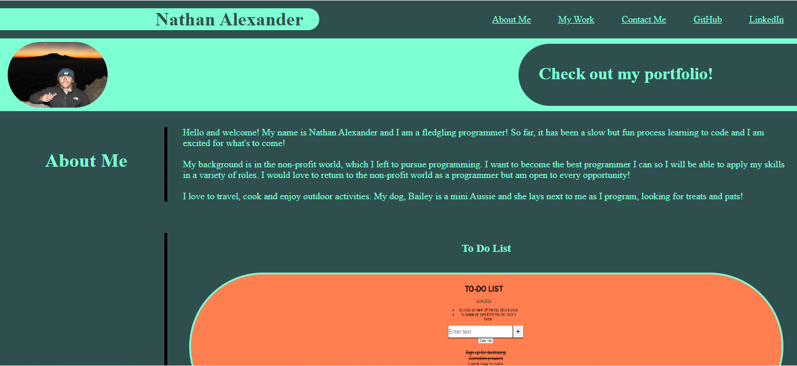
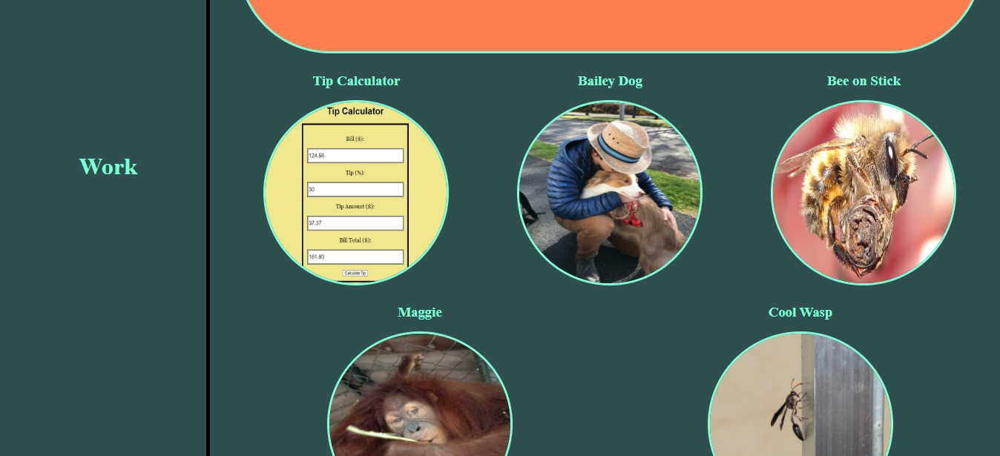
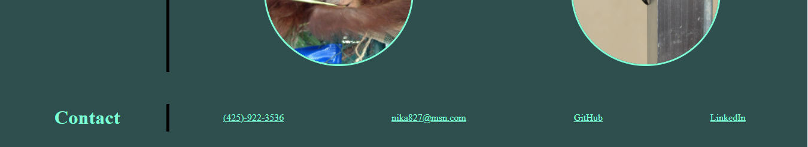

# Nathan-Portfolio-Project

Description:

This repo features my personal portfolio, which will be added to on an ongoing basis. It is written in HTML and CSS with more functionality to come. 

It includes links to two projects so far, a Tip Calculator app and a To Do List app, both of which use HTML, CSS and JS. All link are functional and user-friendly. 

Installation: N/A

Usage: N/A

Credits: Nathan Alexander

License: Please refer to the license in the repo

Badges: N/A

Features: Functional links, media queries for 768px and 576px, general responsiveness to various screen sizes.

How to Contribute: N/A

Tests: N/A

Screenshot:

Deployed Link:

